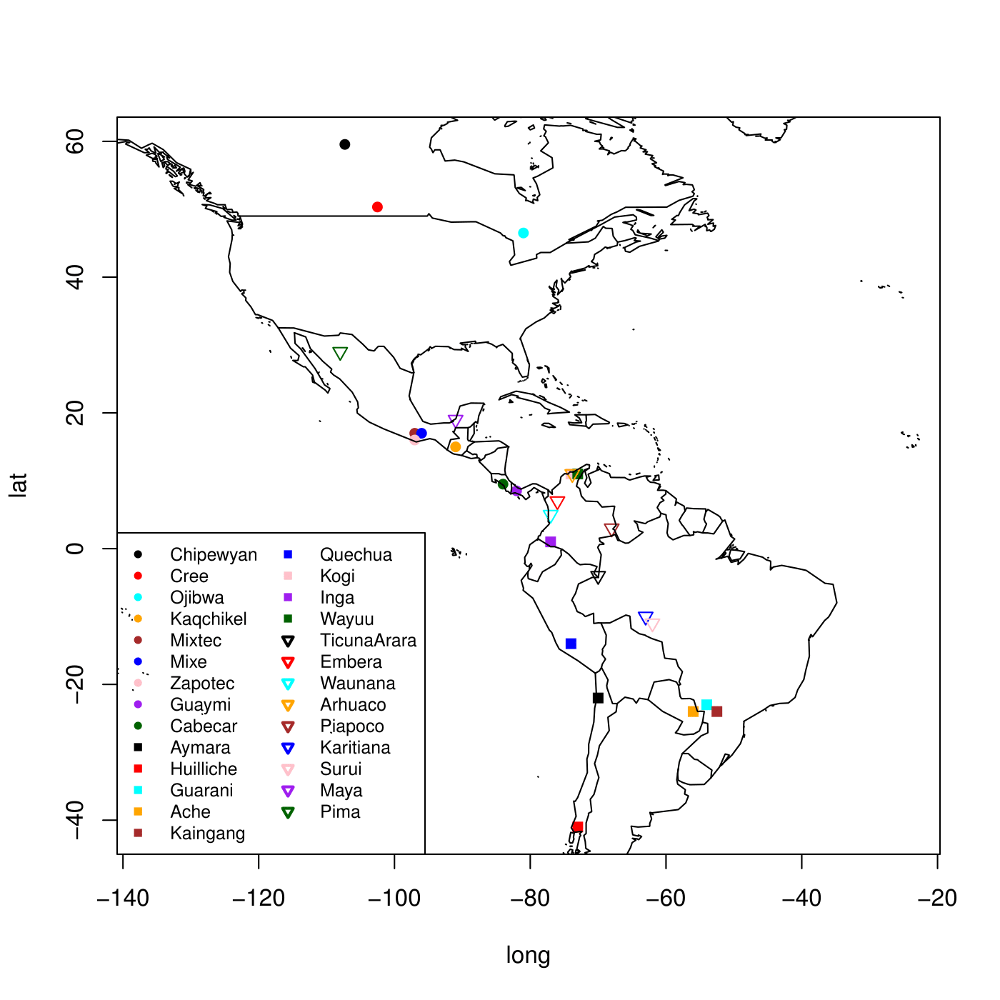

## Classification des populations autochtones d'Amérique selon leur diversité génétique

## Data
Nous disposons d'un jeu de données qui contient 5709 marqueurs génétiques relevés sur 494
individus appartenant à 27 populations autochtones d'Amérique du Nord, d'Amérique centrale et
d'Amérique latine. Ce jeu de données se caractérise essentiellement par le fait qu'il y'ait plus
de variables (5709) que d'observations (494).

## Objectif
Prédire la population d'origine d'un individu connaissant les 5709 marqueurs.

## Méthodologie
Il s'agit d'un problème de classification multiclasse. D'abord, une analyse en composantes principales est appliquée
afin de réduire le nombre de variables. Ensuite, différentes méthodes de classification sont appliquées sur les données
transformées : régression logistique, LDA, KNN, arbre de décision, random forest. 

## Résultats
\begin{center}
	\captionof{table}{Taux d'erreur des différentes méthodes}
	\begin{tabular}{|c|c|}
		\hline
		Méthode & Taux d'erreur \\ \hline
		ACP + logistique & 0.106 \\ \hline
		ACP + LDA & 0.096 \\ \hline
		Logistique + Ridge & 0.053 \\ \hline
		Logistique + Lasso & 0.138 \\ \hline
		KNN & 0.149 \\ \hline
		Arbre de classification & 0.489 \\ \hline
		Pruning & 0.52 \\ \hline
		Random forest & 0.32 \\ \hline
		ACP + Random forest & 0.180 \\ \hline
	\end{tabular}
	\label{tab:resume}
\end{center}
